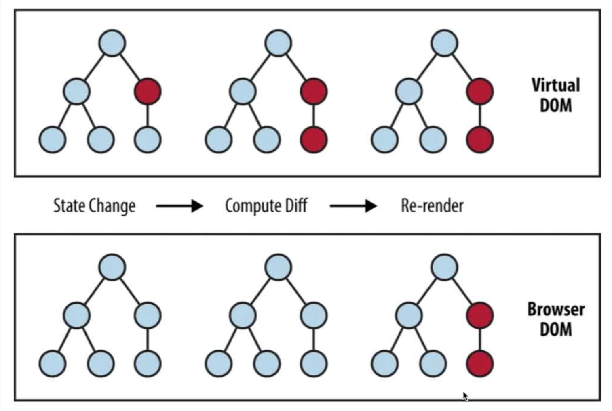

# 📚 React & Next 2026 - Rocketseat

## 📌 Iniciação

Nesse módulo você dará os seus primeiros passos com o React entendendo o que é React e o que não é, DOM x Virtual DOM, árvore de renderização, reconciliação, como reutilizar código por meio de componentes, formas de rodar o React e como criar o seu "Primeiro Hello World".

## 📌 O que React não é e o que ele é

- React, a biblioteca para interfaces web e nativas

### 🔍 O que o React não é:

- Um framework completo: React é uma biblioteca focada na UI (interfaces), não resolve coisas como roteamento, validação de formulários, requisições HTTP, internacionalização. Ele desenha interfaces na tela. Para conseguir esses outros elementos precisa utilizar outras bibliotecas junto com o React.
- Um substituto do HTML, CSS e JS: React usa o melhor do que temos de forma nativa para facilitar a manipulação de DOM. Você vai usar HTML, CSS e Javascript.
- Não é autossuficiente: Precisa de outras bibliotecas (ex: React Router para fazer roteamento, Zod, React Hook Form para fazer formulários, etc.) para construir aplicações completas
- Não é apenas um renderizador apenas para web: O core do React pode ser usado para aplicativos mobile (React Native), terminais (ink) entre outros.

### 🔍 O que é o React é:

- Uma biblioteca para criar interfaces declarativas: Você descreve como a UI (interface) deve ser com base no estado (propriedades, componentes), e o React gerencia as mudanças no DOM.
- Baseado em componentes: A grande maioria do código é dividido em componentes (pequenos pedaços de bloco) reutilizáveis e isolados.
- Reativo: Atualiza a interface automaticamente quando o estado muda.
- Unidirecional no fluxo de dados: O estado flui de cima para baixo (de pai para filho), o que facilita o controle da aplicação.
- Virtual DOM: Usa uma representação virtual do DOM para fazer atualizações eficientes.

✨ Resumindo: O React é uma biblioteca para construir interfaces de usuário de forma declarativa e eficiente, mas não resolve tudo sozinho. Para aplicações reais você irá utilizar outras bibliotecas para compor o projeto.

## 📌 Tipos de aplicação WEB

Existem duas formas principais para criar aplicações utilizando o React como base de renderização. Em ambas as maneiras todo o carregamento da página é dinâmico e não precisa recarregar completamente o HTML vindo do servidor.

### 🔍 SPA - Single Page Application

- É uma aplicação web que carrega uma única página HTML e atualiza dinamicamente.
- O navegador carrega um HTML básico junto com todos os arquivos de Javascript e CSS.
- Pode ser hospedada em qualquer CDN (ex: AWS S3).

### 🔍 SSR - Server Side Rendering

- É uma aplicação que carrega uma única página HTML e atualiza dinamicamente
- O navegador carrega um HTML básico junto com os arquivos de Javascript e CSS
- É necessário um servidor NodeJS para hospedar a aplicação.
- Consegue buscar os dados no servidor antes de carregar no front end.

## 📌 DOM vs Virtual DOM

### 🔍 DOM

- DOM é o Document Object Model do Javascript, ele é toda a parte do HTML que você tem mas do lado do Javascript, colocando eventos. O HTML é uma linguagem de marcação e não consegue colocar interatividade em si como cliques ou outros eventos.

- É a estrutura de árvore que os navegadores criam para representar o HTML da página ao lado do Javascript.

### 🔍 Virtual DOM

- É uma cópia leve do DOM real, mantida pelo React. Quando há mudanças no estado, o React utiliza primeiro o Virtual DOM, compara com a versão anterior (processo chamado **diffing**) e aplica apenas as mudanças necessárias no DOM real (processo chamado **reconciliation**), otimizando a performance.

✨ O **Virtual DOM** é como um "rascunho" eficiente do DOM real, permitindo atualizações mais rápidas e menos processamento pesado. O Virtual DOM fica na memória, não fica na tela. É como se fosse um objeto comparando com outro, aplicação seja rápida e escalável, com mais performance.

### 🌲 Árvore de Renderização

- Conhecida mundialmente como "**Render Tree**", ela é usada pelo navegador para desenhar os elementos na tela, após toda a parte de diffing e reconciliation já finalizada.
- Essa estrutura permite que dados sejam enviados de cima para baixo. De componentes (elementos) pai para componentes (elementos) filho.

Vale lembrar que todo esse processo é feito automaticamente pelo React. Você como dev não precisa fazer nada nessa parte de renderização direta no Javascript.

## 📌 Hooks

### 🔍 Gerenciamento de Estado (Hooks e Context API)

**O que é**: Imagine que seu app é um formulário. O "estado" é o que está escrito nos campos agora. Se o usuário muda de página e volta, o app precisa "lembrar" o que foi digitado. Gerenciar estado é controlar como a informação flui e é guardada.

**Hooks**: Um hook é uma função especial que permite aos componentes funcionais do React gerenciarem estado e ciclo de vida. Antes dos hooks, só podiamos fazer isso com classes. Eles "engancham" a nossa função nas funcionalidades internas do React, permitindo criar aplicações mais simples, limpas e reutilizáveis.
